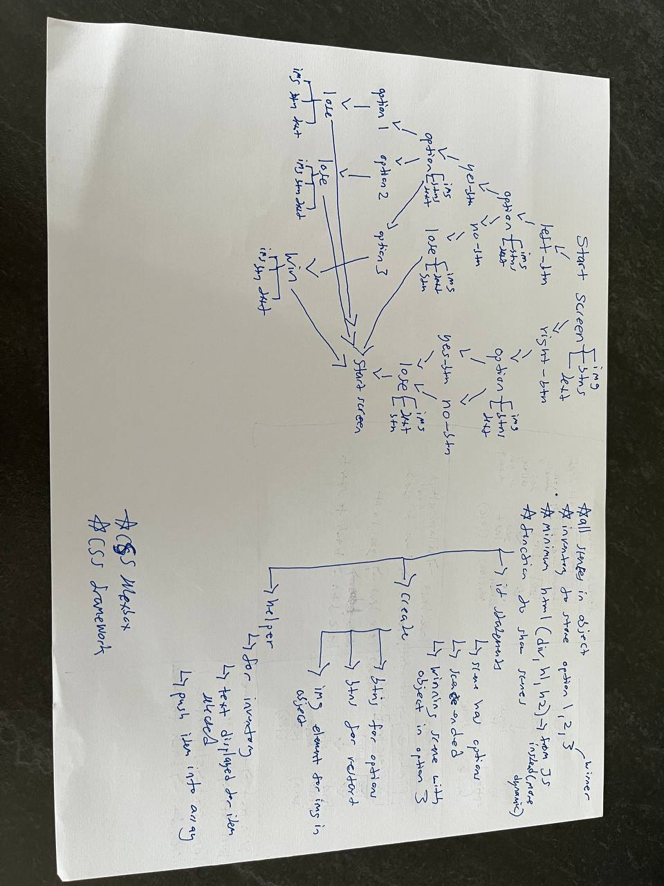
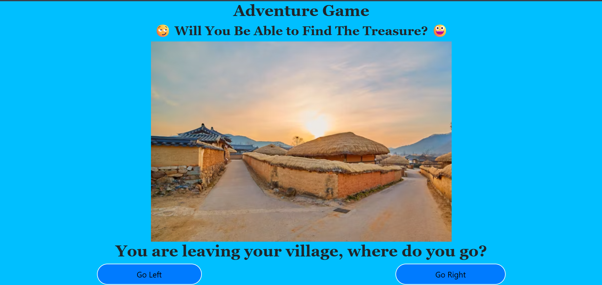
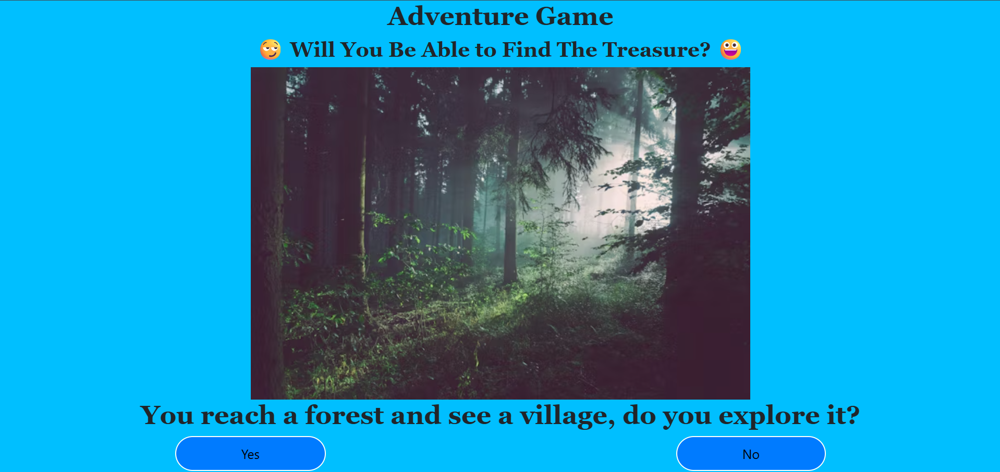
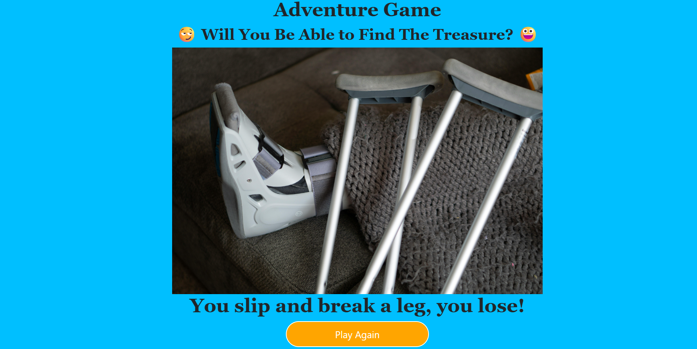

# Adventure-Game
Adventure Game
---
Project Brief
---
MVP - Minimum Viable Product
---
This game is built with HTML, CSS and JavaScript. The game is committed to Github often over the course of the project and this README.md file serves to explain the technology used, how i strutured the game and my workflow. This game needs DOM manipulation, in this case, it would be using mouse click.
---
Timeframe
---
1 week
---
Technologies & Tools Used
---
HTML
CSS
JavaScript
Git & GitHub
---
Description
---
Most of us have played a choose your adventure role playing game before. I played similar games when i was younger, which was why i chose to undertake this project. It would be fufilling to me to create a game I would enjoy to play.  This single-player game will serve as a version where the user can make choices which will impact the outcome of the game (whether you are able to find the treasure). The game was designed and implemented using HTML, CSS, and Javascript while attending the Software Engineering course at General Assembly (Singapore).
---
Deployment
---
The game is deployed on GitHub pages, and you can play the game here: https://dvdyn989.github.io/Adventure-Game/
---
How To Play
---
Use your mouse to click buttons to select options to try to find treasure and win.
---
WireFrame
---
I planned out the design and the logic for the game before starting to code. Doing so will give me a clear plan on what and how to code, the relevant JavaScript concepts needed, and break the project down into smaller parts which I could tackle first.
---
I first did up my user stories per the below.
---
-The user should be aware he is in the game, i.e., a clear start screen should be defined.
-The user should be able to start the game from the start screen, clear instructions and buttons should be created and defined.
-Upon starting the game, the user should be clear on the available options and its context, i.e., clear scene text and buttons for the options should be created.
-There should be several options per scene for the user to choose from.
-Pictures relevant to the options should be triggered when the user chooses them with alt text included to ensure the game is accessible.
-At least 4 possible endpoints should be created and defined.
-The user should select the correct options to win the game.
-The user should be aware whether he has won or lost the game.
-After ending the game, the user should go back to the start screen with the option to play again.
---
I then started on the logic per the below.
Object to hold all my scenes.
Creating a function to show my scenes.
If statements to activate certain scenes and features (i.e., buttons and images) depending on user's choice and game status.
Creating a function to add selected items to inventory in order for user to win the game
*should incorporate CSS flexbox or a CSS framework to beautify the game.
---
 -Wireframe
---
Pictures of game
---
 - Start scene
 - Option scene
 - End scene
---
Key reflections
---
This is my first time doing a project that combines HTML, CSS and Javascript (JS). I was careful to determine which JS concepts were needed and how they would combine for the game to function before starting. I learnt alot throughout this process such as how to use JS tools to determine and impact game flow. In addition, minimizing HTML usage in creating this game and using JS most of time has helped strengthen my JS knowledge and how I can use JS.
---
Next steps
---
I could expand the game by including more scenes and options. I could also make it where the user needs to collect more than one item to win, and incorporate different endings for different items the user picked up. Additonally, I could even continue the game further depending on the item picked up.
---
Atrributions
---
I used bootstrap for my CSS framework for this project.
Link: https://getbootstrap.com/
---
Thank you.